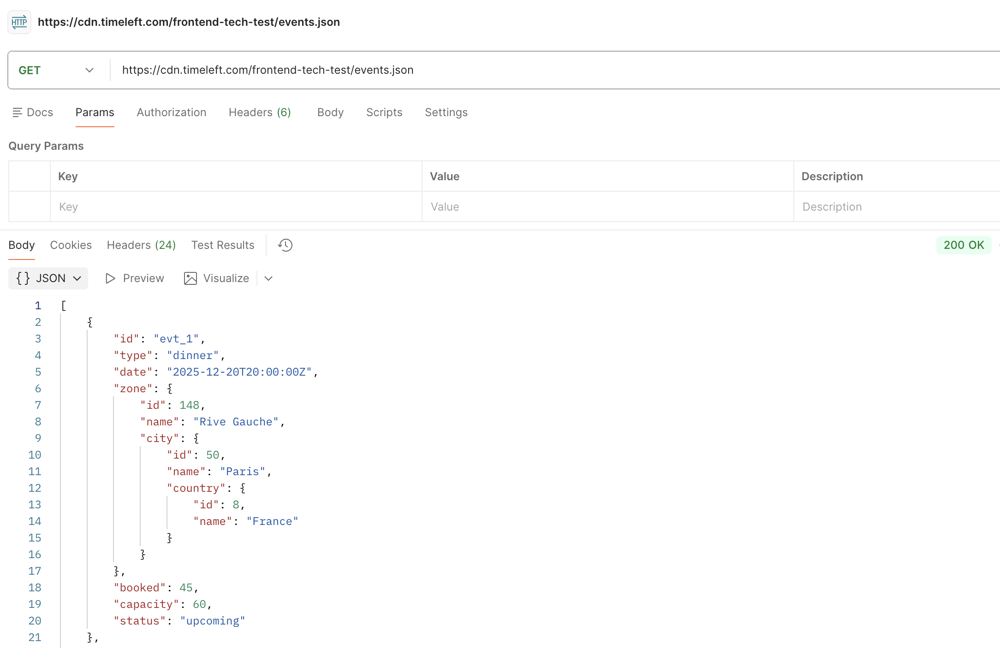

# Timeleft Mobile Frontend Technical Test

This repository contains the mobile frontend technical assessment for Timeleft. The application is built using React Native, Expo SDK 55, and TypeScript, featuring a high-fidelity event discovery experience.

The detailed instructions and requirements for this test can be found in the [Timeleft Technical Test Notion Document](https://app.notion.com/p/timeleft/Mobile-Frontend-Technical-Test-36b8d7bb13a281efac5ccfd90f0ee4f0).

## Get started

1. Install dependencies

   ```bash
   npm install
   ```

2. Start the app

   To run the development bundler:
   ```bash
   npx expo start
   ```

   To build and run the native development build directly on your devices:

   - **iOS Device or Simulator**:
     ```bash
     npx expo run:ios --device
     ```
     *(Alternatively, you can open the project's `ios/` folder in Xcode and launch it, keeping `npx expo start` running)*

   - **Android Device or Emulator**:
     ```bash
     npx expo run:android --device
     ```

   In the output of `npx expo start`, you can also trigger simulation/sandboxing options:
   - Press `i` to open in the **iOS Simulator**
   - Press `a` to open in the **Android Emulator**
   - Scan the QR code to open in **Expo Go** (if using standard Expo Go environment)

## Architectural Decisions & Trade-Offs

### 1. Hybrid Event Statistics (`<StatsBar>`)
* **Decision**: Showed event statistics in a hybrid format (`Filtered / Global` counts, e.g. `2 / 5` Live events).
* **Trade-Off**: A static count is simple but ignores filter reactivity. A purely filtered count hides the overall database catalog size. The hybrid solution provides a constant dataset overview while providing real-time feedback as the user searches or applies city and status filters.

### 2. Collapsible Filter Drawer vs. Native Modals
* **Decision**: Implemented an inline collapsible absolute drawer below the SearchBar instead of native full-screen modal screens.
* **Trade-Off**: Avoids full-page navigation pushes to keep the search context intact. To prevent layout issues, we wrapped the panel in a relative wrapper with a full-screen semi-transparent backdrop to block card presses, lock list scrolling, and dismiss the filter panel on outside taps.

### 3. Default Filtering & Sorting (Multi-Select Statuses)
* **Decision**: Converted status filters into a multi-select chip array initialized with `Upcoming` and `Live` events active (hiding `Past` events by default), and sorted by date ascending (`date-asc`).
* **Trade-Off**: Hiding past events by default is critical for discovery UX: over time, past events will vastly outnumber upcoming events, which would otherwise clutter the feed and bury active listings. Setting the default sort to date-ascending ensures users see soonest events first, while still allowing them to toggle on "Past" events or sort by popularity/availability if needed.

### 4. Custom Hook State Separation (`useEvents`)
* **Decision**: Extracted API client cache calls, search query states, active filters, and sorting algorithms into a custom `useEvents` hook.
* **Trade-Off**: Follows the Single Responsibility Principle (SRP) by keeping page files strictly presentation-focused, which makes UI testing and debugging much cleaner.

### 5. Expo SDK 55 over SDK 56
* **Decision**: We chose to build the application using Expo SDK 55 instead of the newly released SDK 56.
* **Trade-Off**: Expo SDK 56 was released on May 21, 2026 (only a few days ago). Opting for Expo SDK 55 ensures platform stability, predictable native builds, and guarantees library compatibility (especially for core layout/animation dependencies like `react-native-reanimated`), avoiding the risks of early adoption bugs.

### 6. Client-Side API Caching (In-Memory Cache)
* **Decision**: Implemented a module-scoped in-memory cache (`cachedEvents` and `lastFetchedTime`) with a 5-minute TTL inside the API service.
* **Trade-Off**: Since the database size varies and can grow up to 1,000+ events per city, fetching from the network on every screen transition (e.g., navigating back and forth between lists and detail screens) would introduce latency and waste user data. Caching results makes detail-to-list transitions instantaneous, while the 5-minute TTL guarantees events stay updated. We also support a `forceRefresh` option for pull-to-refresh to completely bypass the cache.

## Future Improvements (With More Time)

If given more time, the following improvements would be prioritized:

1. **Designer Collaboration & UI Aesthetics**:
   * Partner with Product Designers to refine typography (e.g. Inter/Outfit custom fonts), add smooth micro-animations for card transitions (using `react-native-reanimated`), and customize skeleton placeholders to match Timeleft's premium branding.

2. **Pixel-Perfect Adjustments & Visual QA Tools**:
   * Integrate visual regression testing tools (like Storybook or visual QA checks) to ensure layouts align perfectly across all simulated iOS and Android form factors, screen densities, and text scaling settings.

3. **Geolocation-Based Default Filtering**:
   * Integrate device location services (using `expo-location` or IP-based geolocation) to automatically select and filter the event feed by the user's current city/country on launch. For example, users opening the app in Madrid would see Spanish events by default, removing the friction of manual filtering.

4. **Differentiating Filter Types (UX Improvement)**:
   * Introduce visual styling distinctions between multiple-choice filters (like "Status") and single-choice filters (like "Type" or "Sort By"). Because both are currently represented by identical chips, it can be ambiguous to the user whether a section allows multiple selections or is mutually exclusive. Adding clear indicators (such as checkbox icons inside multi-select chips or radio-button markers/segmented controls for single-select options) would greatly improve the user experience.


## Testing Strategy & Priorities

Testing is optional for this exercise, and automated tests have not been implemented. Below is our proposed testing methodology, detailing how we would approach testing this React Native / Expo application and what we would prioritize.

### 1. Test Prioritization Matrix

If we were to write tests, we would prioritize them based on the **criticality of business logic** and the **likelihood of regressions**:

| Priority | Scope | Target Files / Areas | Rationale |
| :--- | :--- | :--- | :--- |
| **High** | Unit Tests | [useEvents.ts](file:///Users/mar/Developer/ReactNative/timeleft-technical-test/src/hooks/useEvents.ts)<br>[formatters.ts](file:///Users/mar/Developer/ReactNative/timeleft-technical-test/src/utils/formatters.ts) | All sorting, filtering, and data-caching states live here. Errors here break the core browse flow. Formatting functions are cheap to test and critical for correct date/occupancy display. |
| **Medium** | Component / Integration | [filter-panel.tsx](file:///Users/mar/Developer/ReactNative/timeleft-technical-test/src/components/filter-panel.tsx)<br>[availability-badge.tsx](file:///Users/mar/Developer/ReactNative/timeleft-technical-test/src/components/availability-badge.tsx) | Verifies user interaction state (e.g., locking scrolling, tapping outside to close filter panel, status chip toggling, capacity status colors). |
| **Low** | End-to-End | [index.tsx](file:///Users/mar/Developer/ReactNative/timeleft-technical-test/src/app/index.tsx)<br>[event/[id].tsx](file:///Users/mar/Developer/ReactNative/timeleft-technical-test/src/app/event/[id].tsx) | Simulates a full user journey (opening app, searching, applying a filter, navigating to details, clicking CTA). High setup cost, but prevents regressions on core app routing. |

---

### 2. Detailed Testing Approach

#### Phase A: Unit Testing (Jest)
* **Goal**: Validate pure functions and custom React Hook states.
* **Testing the custom hook `useEvents`**:
  * Use `@testing-library/react-hooks` or React's built-in `renderHook` utility.
  * Mock `src/api/eventsApi.ts` client to return a fixed dataset of events with varied cities, dates, capacity statuses, and popularity.
  * **Test Cases**:
    - **Default state**: Verify `events` lists only `live` and `upcoming` events by default, sorted by date ascending (`date-asc`).
    - **City selection**: Verify selecting "Paris" updates the active list, filtering out non-Paris events.
    - **Multi-select statuses**: Verify that toggling off "Upcoming" keeps "Live" visible, and toggling on "Past" displays past events.
    - **Sorting algorithms**: Verify sorting by popularity sorts by filled percentage ascending/descending.
    - **Search queries**: Verify searching for a zone (e.g., "7th arrondissement") or country (e.g., "France") yields correct items case-insensitively.
    - **Cache behavior**: Verify that triggering pull-to-refresh calls the network, while page load retrieves cached events to maintain UI performance.
* **Testing `formatters.ts`**:
  * Direct inputs and outputs tests for `formatDate` and `calculateCapacityStatus`. Ensure proper localized date formatting strings and correct boundaries for progress indicators (e.g., 80% boundary for "Filling Fast").

#### Phase B: Component & Integration Testing (React Native Testing Library)
* **Goal**: Verify visual elements render correctly and respond to simulated user events.
* **Key Scenarios**:
  * **Filter Overlay dismissal**: Render browse screen and simulate a user press on the filter panel toggler. Verify the drawer is rendered. Press the backdrop overlay and verify the panel disappears.
  * **Capacity Bar semantic states**: Render `AvailabilityBadge` with different mock capacity ratios (e.g., green vs. orange vs. red). Verify that appropriate status colors and labels are injected.

#### Phase C: End-to-End Testing (Maestro / Detox)
* **Goal**: Black-box regression testing on simulated iOS and Android devices.
* **Scenario**:
  1. Boot the application.
  2. Verify the search input and lists are visible.
  3. Type "Spain" in the search input and tap the filter chip.
  4. Select a card from the results.
  5. Verify Expo Router navigates to the detailed card page (`/event/[id]`).
  6. Confirm the details page displays the correct information and has the "Book Now" CTA.

## Questions & Ambiguities Identified in the Brief

While implementing the requirements, the following ambiguities in the brief were identified and resolved:

### 1. High-Level Statistics Scope (Global vs. Filtered)
* **Ambiguity**: The brief requested "high-level stats (total events, counts by status)". It was unclear if these should represent static **Global** numbers (total size of the database catalog) or dynamic **Filtered** numbers (counts responding to active search query, city, or type selections).
* **Resolution**: We implemented a **hybrid presentation** displaying counts in a `{Filtered} / {Global}` format (e.g., `2 / 5` Live events). This satisfies both interpretations, showing a database overview while keeping stats completely reactive.

### 2. Multi-Select Statuses vs. Single Select
* **Ambiguity**: The brief did not specify whether status filtering should be single-select (mutually exclusive) or multi-select.
* **Resolution**: A single status selection limits standard browsing (e.g., users often want to see both `Live` and `Upcoming` events together while hiding `Past` events). We implemented **multi-select chip toggles** (array-based querying) and set the default state to show both active/upcoming events to deliver a much more functional search interface.

## Technical Roadmap

Detailed documentation of the design decisions, component hierarchy, state layers, and implemented features can be found in the repository:

- **[Technical Roadmap](file:///roadmap.md)**: Describes the project's layered clean architecture, schemas, API client caching strategy, and custom hooks.

## Code Quality & Linting

To verify TypeScript typing and code cleanliness conventions, run the linter:
```bash
npm run lint
```

## Anything Else That You Feel Is Important to Include

### 1. Roadmap & Architecture Summary
This project follows a clean, decoupled architecture built on SOLID principles:
* **Presentation Layer**: Consists of React Native components `index.tsx`, `event/[id].tsx` and visual widgets `filter-panel.tsx`, `stats-bar.tsx` designed to render dynamic layouts reactively.
* **Domain Layer**: Separated logic into a custom `useEvents.ts` hook that manages active states (search query, selected city, selected status, and sort filters) and performs client-side data operations. Pure formatters for dates and capacity statuses are encapsulated in `formatters.ts`.
* **Data Layer**: Integrates client-side in-memory caching in the API service (`eventsApi.ts`) with a 5-minute invalidation TTL, maximizing UX navigation speed and minimizing network consumption.
* **Implementation Roadmap**:
  1. **API Analysis & Schema Verification**: Analyzed the JSON payload structure and properties returned by the CDN endpoint using Postman to verify data types and map the domain models accurately.
     
  2. **Main Screen & Reusable Components**: Built the browse view container utilizing a performance-optimized list rendering modular cards (`event-card.tsx`), badges (`availability-badge.tsx`), and skeleton loaders.
  3. **Navigation & Dynamic Details**: Implemented file-based dynamic routing (`event/[id].tsx`) using Expo Router to handle transition states and show full details for selected events.
  4. **Interactive Search & Filtering**: Developed the collapsible filter drawer (`filter-panel.tsx` / `search-bar.tsx`) for searching and combining multi-select cities, statuses, and sorting preferences.
  5. **Hybrid Event Statistics**: Integrated the reactive statistics banner (`stats-bar.tsx`) at the top of the feed to provide immediate visual feedback of both filtered and total database counts.

### 2. Task Completion & Commit History
The step-by-step progress and implementation stages of this technical test have been documented incrementally. You can review the complete chronological progression of task completions, refactoring steps, and documentation updates directly through the Git commit history on GitHub (e.g., via commits on the `docs/delivery` branch).
